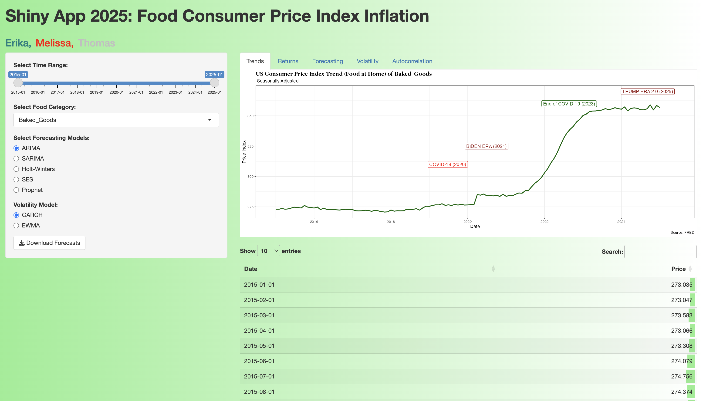
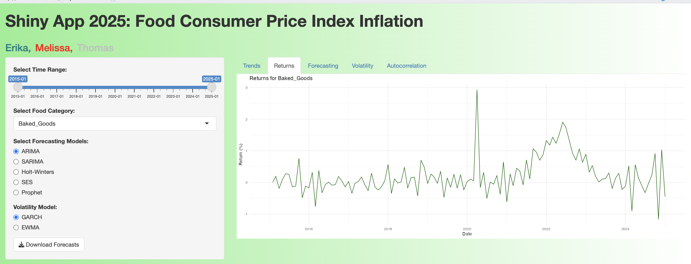
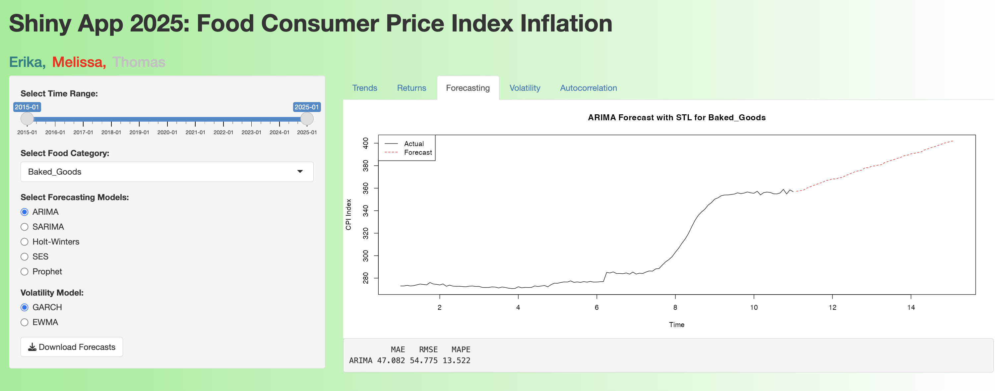
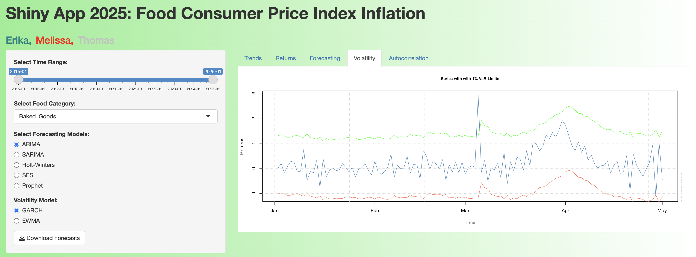
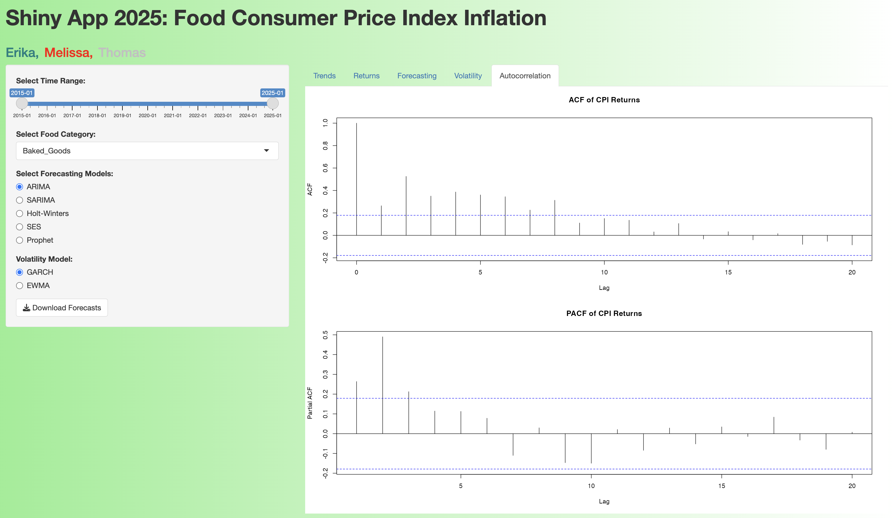

# Shiny App 2025: Food Consumer Price Index Inflation 

## Introduction
This is a collection of files for Data613. This project aims to develop an interactive Shiny app that visualizes the Monthly Cost of Goods in the U.S. over the past 10 years, focusing on food Consumer Price Index (CPI) inflation using data from the Federal Reserve Economic Data (FRED). The app automates CPI data collection and applies a range of econometric and time series forecasting models—including ARIMA, SARIMA (Seasonal ARIMA), Holt-Winters, Prophet, and Simple Exponential Smoothing (SES)—to analyze trends and predict future inflation for categories like "Dairy," "Meat, "Fruit," "Baked Goods" and "Alcoholic Beverages." It also incorporates volatility modeling techniques such as GARCH  (Generalized Autoregressive Conditional Heteroskedasticity) and EWMA (Exponentially Weighted Moving Average) to assess fluctuations in food prices over time, offering users an interactive, data-driven exploration of food inflation dynamics in the U.S.

## Business Understanding

1. Objective:To develop an interactive Shiny app that visualizes and forecasts U.S. food CPI trends using FRED data, helping users explore inflation patterns and predict future price movements across food categories.
   
2. Key Focus Areas:
  - Food at Home CPI: Baked Goods, Dairy, Meat, Fruit
  - Alcoholic Beverages CPI
  
3. Key Questions:
  - What are the historical trends in food inflation?
  - How do food inflation trends compare to alcoholic beverage prices?
  - What are the seasonal patterns and long-term trends?
  - Can we accurately forecast CPI using econometric models?
  - How can users interactively explore and compare different forecasting models?

## Shiny App: Interactive Features

User Inputs:
  - Dropdown: Select CPI category (Food at Home / Alcoholic Beverages)
  - Slider: Choose date range (e.g., Jan. 2015 – Jan. 2025)
  - RadioButtons: Compare different forecast and volatility models

Outputs:
1. Time Series Visualization:
  - Historical CPI trends
  - CPI Growth Rate (Returns)
2. Forecasting Models:
  - Compares ARIMA vs SARIMA vs Prophet vs SES vs Holt-Winters
  - Displays the MAE (MAE), RMSE, and MAPE (Performance Metrics) results
  - Allow users to download forecasts
3. Volatility Analysis:
  - GARCH & EWMA models
  - Autocorrelation plots

Datasets will be combined based on observed dates. Total expenditures for "Food at Home" and "Alcoholic Beverages" will be summed and compared with yearly CPI percentage changes, and predictive modeling techniques such as machine learning approaches may be explored for forecasting.

## Libraries Used

- *library(shiny)*
- *library(ggplot2)*
- *library(dplyr)*
- *library(forecast)*
- *library(prophet)*
- *library(tseries)*
- *library(rugarch)*
- *library(TTR)*
- *library(stats)*
- *library(FactoMineR)*
- *library(factoextra)*
- *library(shinyWidgets)*
- *library(DT)*

# Preview of the R Shiny App

## References
 - FRED Economic Data, CPI for U.S. City Average: Monthly, Seasonally Adjusted:[ https://fred.stlouisfed.org/](https://fred.stlouisfed.org/release/tables?rid=10&eid=34483#snid=34486)

